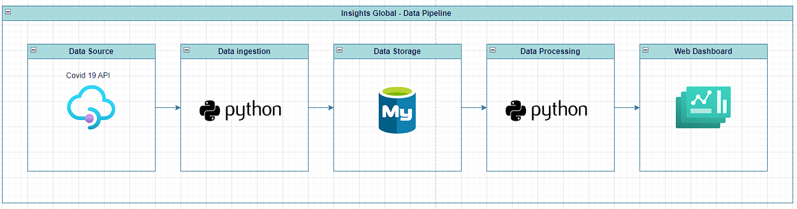
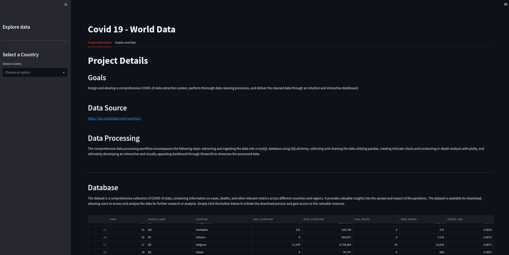
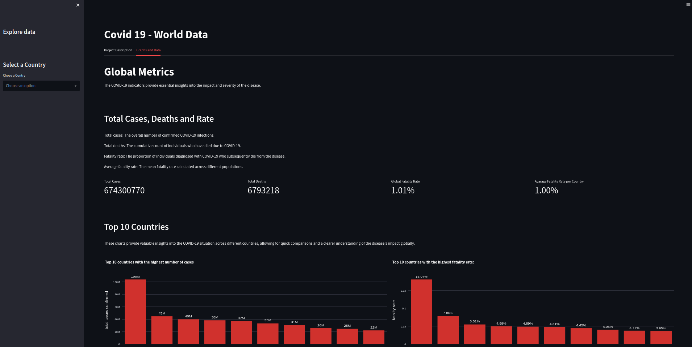
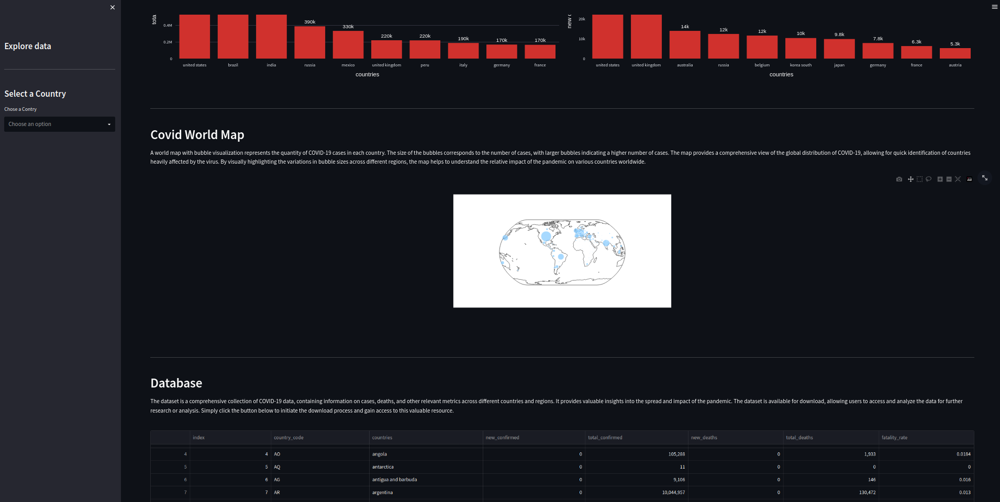

# Insights Global
<b>Alert:</b> All the problems and premises contextualized in the project are fictional. Its sole purpose is to give meaning to the development of the solution  
# Insights Global Covid 19 Dashboard
This project is a web dashboard created with Streamlit in Python and other libraries.
  

    

 

## 1. About Insights Global
Insights Global is a leading journalistic company specializing in providing global news and analysis. With a talented team of journalists and analysts, they offer reliable and timely information on global events and issues. Their commitment to journalistic excellence and data visualization makes them a trusted source for readers seeking accurate insights into the world.
  

### 1.1. Business Problem
Global Insights company needs a dashboard to track the evolution of COVID-19 cases by country, with the objective of understanding the number of deaths, cases, fatality rate, new cases, and recent deaths. The data source should be the COVID-19 data API.
  

### 1.2. Premissas do negócio
- North Korea does not provided data from covid.
- Fatality rate is the result of divide total deaths by total cases.
- New confirmed is related to new cases that happened last week.
  

### 1.3. About Data
| Field                            | Description                                                  |
| -------------------------------- | ------------------------------------------------------------ |
| country_code                     | A code to represent each country                             |
| countries                        | The Country name                                             |
| new_confirmed                    | Bew covid cases that happened a week ago                     |
| new_deaths                       | New covid deaths that happened a week ago                    |
| total_confirmed                  | The amount of cases across per country across the time       |
| total_deaths                     | The amount of deaths across per country across the time      |
| fatality_rate                    | Result of divide total deaths by total cases                 |

  

## 2. Strategies to solve the problem
  

    

 

### 2.1. Data Extraction
Using Python with the libraries pandas and request, extract data from covid 19 API.
  

### 2.2. Data ingestion
After getting the databases ingest the data into the mySQL database using SQLAlchemy for that.
  

### 2.3. Calculate indicator and Build Dashboard
Having the data stored in MySQL, take that and make all the necessary KPIs to show in the Dashboard. Build Dashboard framework with streamlit in python.
  

### 2.4. Deploy
Show indicators on a website powered by streamlit.
  

## 3. Dashboard
  

    

 

    

 

    

 

## 4. Python Libraries
pandas, requests, inflection, os, dotenv, SQLAlchemy, streamlit, plotly e pycountry.
  

## 5. Lessons Learned
- How to extract Data from an public api;
- How to combine os and dotenv to not expose password and sensitive information;
- Building a Dashboard entirely with python.
  

## 6. Next Steps
- Data ingested into a database that is in a cloud;
- Modularize and split functions for even cleaner code;
- Orquestation data pipeline using AirFlow;
- Deploy the solution.
  